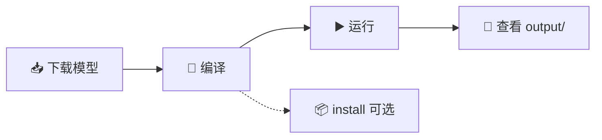
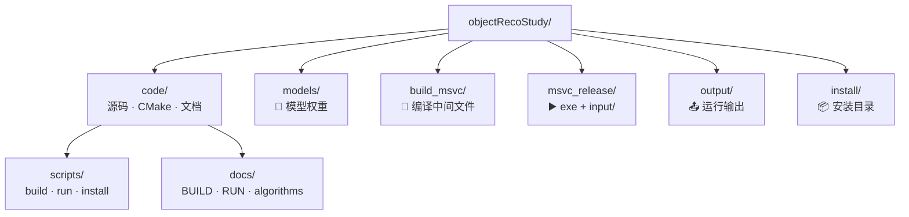

# 🎯 objectRecoStudy

基于 **MFC + OpenCV DNN** 的目标识别与分割学习程序，涵盖 Mask R-CNN、SSD MobileNet、GrabCut、多边形逼近等算例，并在界面中展示输入输出与运行日志。

| 项目 | 信息 |
|------|------|
| 📦 版本 | 1.2.0 |
| ©️ 版权 | Copyright © 1999-2026 Aesthetic Company Limited. All rights reserved. |
| 📧 联系 | 342247588@qq.com · 微信 kelvinluo79 |

## ✨ 功能概览

| 类别 | 算例 |
|------|------|
| 🎭 实例分割 | Mask R-CNN（图像 / 摄像头 / 视频） |
| 🔍 目标检测 | SSD MobileNet v2 视频检测 |
| ✂️ 分割优化 | 检测框 + GrabCut + `approxPolyDP` 四边形逼近 |
| 🖱️ 交互分割 | GrabCut 参数学习 |
| 🧠 框架专题 | Caffe / TensorFlow / PyTorch / SSD / 经典 ML |

界面特性：

- 🎨 分组布局与 **Microsoft YaHei UI** 字体，避免中文乱码
- 💡 每个按钮/输入框配有 **旁注说明** 与 **鼠标悬停提示**
- ℹ️ 「关于」对话框显示 CMake 版本号与版权信息
- 🖼️ 预览区显示算例输出图像，右侧日志记录路径与耗时


## 🚀 快速开始



### 1️⃣ 下载模型

```bat
code\scripts\download_models.bat
```

模型说明与下载链接见 [docs/models.md](docs/models.md)。

### 2️⃣ 编译

```bat
code\scripts\build.bat
```

详见 [docs/BUILD.md](docs/BUILD.md)。

### 3️⃣ 运行

```bat
code\scripts\run.bat
```

详见 [docs/RUN.md](docs/RUN.md)。

### 4️⃣ 安装（可选）

```bat
code\scripts\install.bat
```

## 📁 目录结构



```
objectRecoStudy/
├── code/                 # 源码、CMake、脚本、文档
│   ├── CMakeLists.txt
│   ├── docs/             # BUILD / RUN / algorithms
│   └── scripts/          # build / run / install / download_models
├── models/               # 模型权重（需下载）
├── msvc_release/         # 可执行文件 + input/
├── build_msvc/           # 编译中间文件
├── install/              # 安装目录
└── output/               # 运行输出
```

所有路径在运行时相对于 **仓库根目录** 解析，移动项目位置不影响编译与运行。

## 🎬 默认演示数据

| 文件 | 位置 |
|------|------|
| 🖼️ `people.jpeg` | `msvc_release/input/people.jpeg` |
| 🎥 `demo.mp4` | `msvc_release/input/demo.mp4` |

构建脚本在检测到源媒体存在时会自动复制。

## 📚 文档索引

| 文档 | 内容 |
|------|------|
| [docs/BUILD.md](docs/BUILD.md) | 🔨 编译与环境配置 |
| [docs/RUN.md](docs/RUN.md) | ▶️ 运行与界面操作 |
| [docs/algorithms.md](docs/algorithms.md) | 🧮 核心算法说明 |
| [docs/models.md](docs/models.md) | 📥 模型下载与路径 |

## 🛠️ 依赖

- Visual Studio 2022（MFC、C++）
- CMake + Ninja
- OpenCV 5.0（`D:\win10\opencv500\build`，或 opencv4130 回退）

路径默认值在 `code/cmake/DefaultPaths.cmake`，可通过 CMake `-D` 参数覆盖。

## 📜 许可证

Copyright © 1999-2026 Aesthetic Company Limited. All rights reserved.
