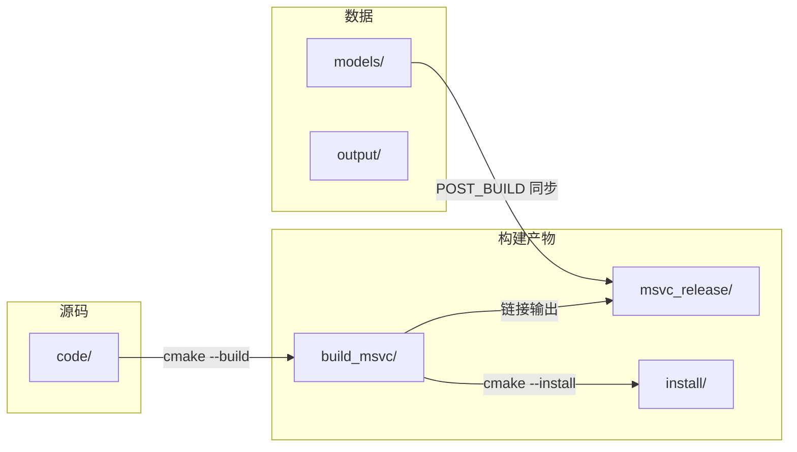
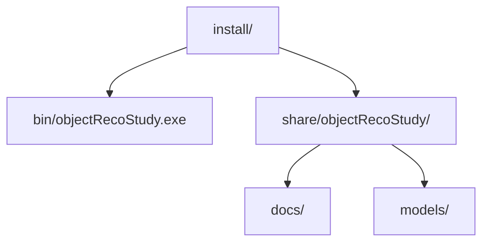

# ? 编译说明 (BUILD)

## ? 环境要求

| 组件 | 说明 |
|------|------|
| ? Windows 10/11 x64 | 目标平台 |
| ? Visual Studio 2022 | 含「使用 C++ 的桌面开发」与 **MFC** 组件 |
| ?? CMake >= 3.20 | 默认 `D:\win10\cmake-4.3.2-windows-x86_64\bin\cmake.exe` |
| ?? OpenCV | 默认 `D:\win10\opencv500\build`，自动回退 `opencv4130` vc16 |

可选依赖路径见 `code/cmake/DefaultPaths.cmake`。

## ? 目录结构



## ? 编译流程


## ? 一键编译

```bat
code\scripts\build.bat
REM Debug: code\scripts\build.bat Debug
```

## ?? 手动 CMake（VS2022）

```bat
cmake -S code -B build_msvc -G "Visual Studio 17 2022" -A x64 ^
  -DOPENCV_DIR=D:/win10/opencv4130/build/x64/vc16/lib
cmake --build build_msvc --config Release
```

## ? 安装

```bat
code\scripts\install.bat
```

安装前缀默认为 `install/`：



## ? 模型（编译前建议）

```bat
code\scripts\download_models.bat
```

链接见 [models.md](models.md)。

## ? 中文界面编码

- ? Unicode 字符集 + 编译选项 `/utf-8`
- ? `objectRecoStudy.rc` 使用 `#pragma code_page(65001)` 与 Microsoft YaHei UI

## ? 常见问题

| 现象 | 处理 |
|------|------|
| ?? MSB8041 需要 MFC | VS Installer → 安装「C++ MFC for latest v143 build tools (x86 & x64)」 |
| ?? OpenCV 不兼容 | `-DOPENCV_DIR=D:/win10/opencv4130/build/x64/vc16/lib` |
| ?? 模型加载失败 | 运行 `download_models.bat` |
| ?? 中文乱码 | 确认 RC 文件 UTF-8 编码且保留 `code_page(65001)` |
