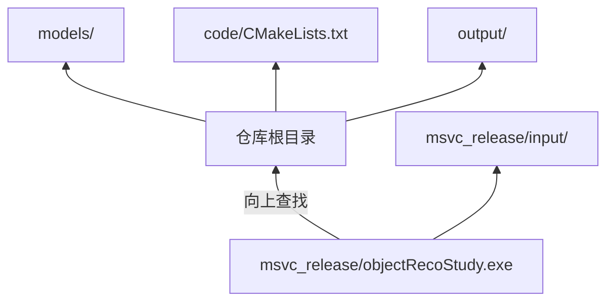
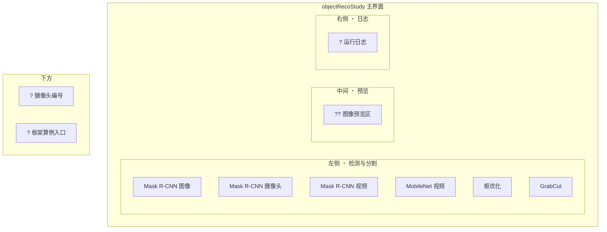
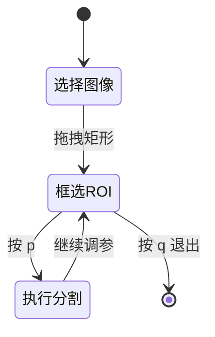
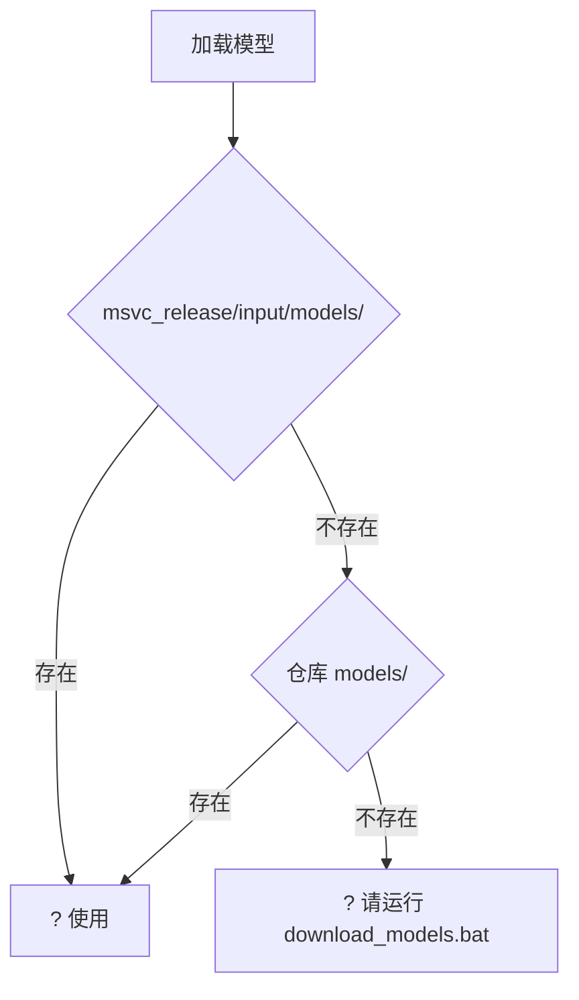

# ?? 运行说明 (RUN)

## ? 启动程序

```bat
code\scripts\run.bat
```

或：

```bat
cd msvc_release
objectRecoStudy.exe
```

程序从 **可执行文件所在目录** 向上查找仓库根（识别 `code/CMakeLists.txt` 与 `models/`），因此移动整个仓库后路径仍然有效。



## ? 默认输入数据

| 类型 | 相对路径 | 说明 |
|------|----------|------|
| ?? 图像 | `msvc_release/input/people.jpeg` | 构建脚本可从 `D:\k8\media_images\xi_an_hot\people.jpeg` 复制 |
| ? 视频 | `msvc_release/input/demo.mp4` | 构建脚本可从默认 mp4 复制 |

未选择文件时，各算例按钮使用上述默认路径。

## ? 输出目录

运行结果写入仓库根目录 `output/`：

| 文件 | 说明 |
|------|------|
| `inputImage.xml` | Mask R-CNN 输入缓存 |
| `foreground.jpg` | GrabCut 前景 |
| `contour_*.jpg` | 多边形逼近可视化 |

## ?? 界面布局



## ? 操作速查

| 区域 | 功能 |
|------|------|
| 左侧「检测与分割」 | Mask R-CNN 图像/摄像头/视频、MobileNet、框优化、GrabCut |
| 中间「预览」 | 算例结果图像 |
| 右侧「运行日志」 | 路径、耗时、状态 |
| 下方「基本设置」 | 摄像头编号（默认 0） |
| 系统菜单「关于」 | 版本号、版权、联系方式 |

? 鼠标悬停按钮可查看 **工具提示**；按钮旁有简短中文说明。

## ?? GrabCut 交互



1. 点击「GrabCut 学习」并选择图像  
2. 在 OpenCV 窗口 `grabcut_source` 中拖拽框选 ROI  
3. 按 **p** 执行分割，按 **q** 退出  

## ? 一键运行

「一键运行全部算例」依次执行 Mask R-CNN 图像检测与图像预览（视频/摄像头算例需手动触发以避免长时间阻塞）。


## ? 依赖运行时

- OpenCV DLL（与编译所用 OpenCV 版本一致，需在 PATH 或复制到 `msvc_release/`）
- MFC 运行库（通常随 Visual C++ Redistributable 提供）

## ? 模型查找顺序



详见 [models.md](models.md)。
