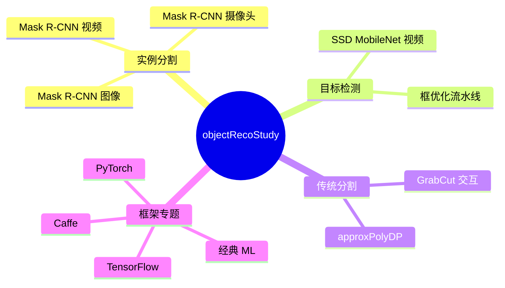
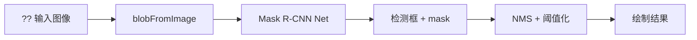
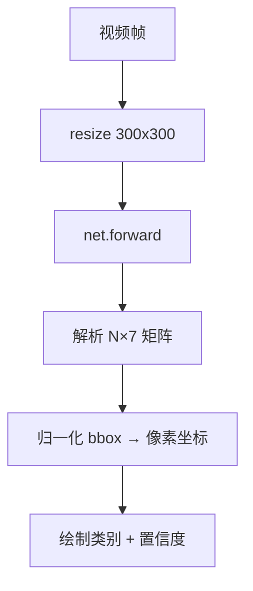
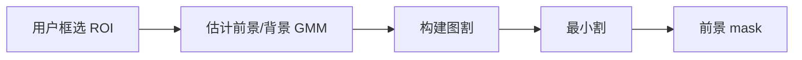
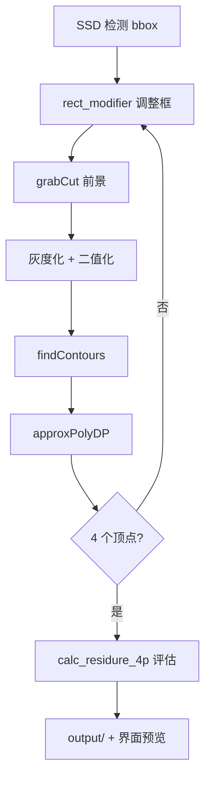
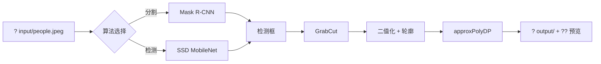

# ? 核心算法说明

本文档概述 `objectRecoStudy` 中各算例对应的算法原理与代码入口。

## ?? 算例总览

---

## 1?? Mask R-CNN 实例分割

**文件**: `mask_rcnn.cpp`, `mask_rcnn.h`

- 使用 OpenCV `dnn::readNetFromTensorflow` 加载 TensorFlow 导出的 Mask R-CNN Inception v2
- 输入：BGR 图像；输出：检测框、类别、置信度与实例 mask
- 后处理：`postprocess()` 对网络输出做 NMS 与 mask 阈值化
- 模型路径通过 `projectpaths::ResolveModelFile()` 解析，避免硬编码绝对路径

**算例**: 主界面「Mask R-CNN 图像 / 摄像头 / 视频」

---

## 2?? SSD MobileNet 目标检测

**文件**: `dnn_02_caffe_example_mobilenet.cpp`

- Single Shot MultiBox Detector + MobileNet 骨干
- `blobFromImage` 将图像缩放到 300×300，均值 127.5，缩放因子 0.007843
- `net.forward()` 得到 `[1,1,N,7]` 检测矩阵，每行：`[id, class, conf, x1,y1,x2,y2]`（归一化坐标）
- `imageProc()` 解析检测并在图像上绘制框

**算例**: 「MobileNet 视频」「MobileNet 框优化」

---

## 3?? GrabCut 前景分割

**文件**: `objectRecoStudyDlg.cpp` ― `main_studyGrabcut()`, `grabCut()`

- 基于图割的交互式分割：用户矩形 ROI 初始化，迭代估计 GMM 前景/背景模型
- 参数 `nums_iter` 控制迭代次数；按键 `p` 触发 `GC_INIT_WITH_RECT`
- 输出前景 mask，可与检测框联合使用

**算例**: 「GrabCut 学习」

---

## 4?? 检测框 + GrabCut + 四边形逼近

**文件**: `objectRecoStudyDlg.cpp`

1. SSD 检测得到归一化 bbox → 像素坐标
2. `rect_modifier()` 在 [-30,30] 范围内步进调整矩形
3. 对每个矩形运行 `grabCut()` 得前景
4. 灰度化、二值化、`findContours` + `approxPolyDP` 逼近四边形
5. `calc_residure_4p()` 评估 mask 与轮廓填充的一致性

**算例**: 「MobileNet 框优化」

---

## 5?? 多边形逼近 (approxPolyDP)

- Douglas-Peucker 算法简化轮廓
- epsilon 从 1 步进到 1000，寻找 4 顶点四边形
- 可视化写入 `output/contour_*.jpg`

---

## 6?? 经典机器学习（框架算例）

**文件**: `ClassicalStudy.cpp`, `classicalBayessianDlg.cpp`, `ClassicalLinearDlg.cpp`

- 贝叶斯分类、线性/逻辑回归、非线性模型为教学扩展入口
- 子对话框提供算例说明，可按本文档补充具体数据集实验

---

## 7?? 深度学习框架专题

| 对话框 | 用途 |
|--------|------|
| CaffeModelDialog | Caffe SSD 说明 |
| TensorflowModelStudy | TensorFlow 检测模型说明 |
| TorchModelStudy | PyTorch 模型说明 |
| ssdModelStudy | SSD 专题 |

---

## ? 端到端数据流

---

## ? 参考

| 算法 | 文献 |
|------|------|
| Mask R-CNN | He et al., ICCV 2017 |
| SSD | Liu et al., ECCV 2016 |
| GrabCut | Rother et al., SIGGRAPH 2004 |
| TensorFlow Model Zoo | [官方索引](https://github.com/tensorflow/models/blob/master/research/object_detection/g3doc/tf1_detection_zoo.md) |
