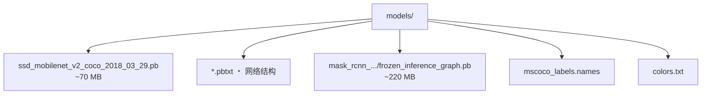
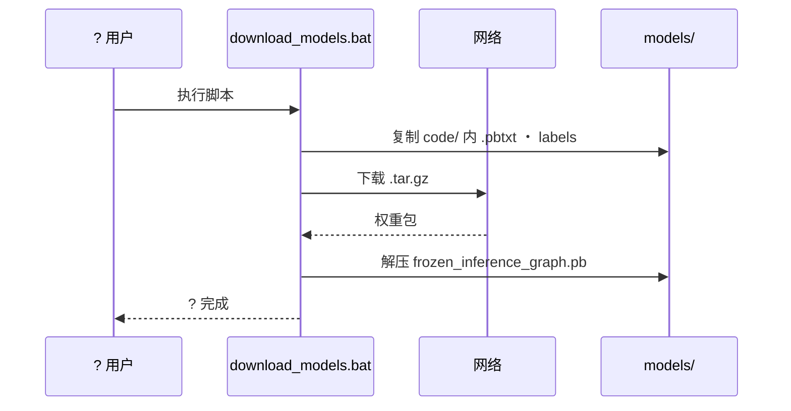
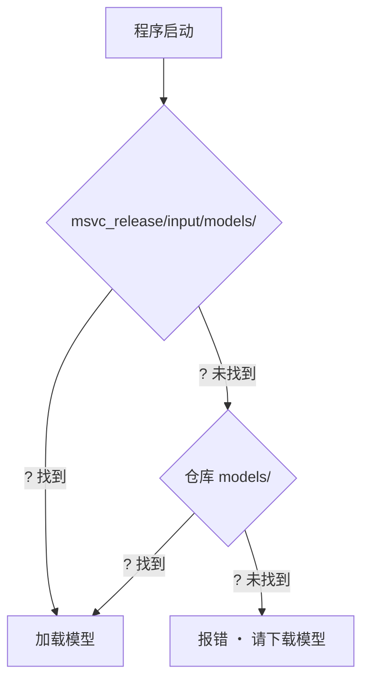

# ? 模型与配置文件

深度学习算例使用 TensorFlow Object Detection Model Zoo 权重，统一放在仓库根目录 `models/`。

## ? 文件清单



| 相对路径 | 说明 | 来源 |
|----------|------|------|
| `ssd_mobilenet_v2_coco_2018_03_29.pbtxt` | SSD 网络结构 | 仓库 `code/` 内置 |
| `ssd_mobilenet_v2_coco_2018_03_29.pb` | SSD 权重 | ? 下载 |
| `mask_rcnn_inception_v2_coco_2018_01_28.pbtxt` | Mask R-CNN 结构 | 仓库 `code/` 内置 |
| `mask_rcnn_.../frozen_inference_graph.pb` | Mask R-CNN 权重 | ? 下载 |
| `mscoco_labels.names` | COCO 类别标签 | 仓库 `code/` 内置 |
| `colors.txt` | 可视化配色 | 仓库 `code/` 内置 |

## ? 下载链接

| 模型 | 下载地址 | 解压后文件 | 保存为 |
|------|----------|------------|--------|
| SSD MobileNet v2 | [tar.gz](https://storage.googleapis.com/download.tensorflow.org/models/object_detection/ssd_mobilenet_v2_coco_2018_03_29.tar.gz) | `frozen_inference_graph.pb` | `models/ssd_mobilenet_v2_coco_2018_03_29.pb` |
| Mask R-CNN Inception v2 | [tar.gz](https://storage.googleapis.com/download.tensorflow.org/models/object_detection/mask_rcnn_inception_v2_coco_2018_01_28.tar.gz) | `frozen_inference_graph.pb` | `models/mask_rcnn_inception_v2_coco_2018_01_28/frozen_inference_graph.pb` |

官方索引: https://github.com/tensorflow/models/blob/master/research/object_detection/g3doc/tf1_detection_zoo.md

## ? 一键下载



```bat
code\scripts\download_models.bat
```

或：

```bat
python code\scripts\download_models.py
```

## ? 运行时查找顺序



构建时 `models/` 会同步到 `msvc_release/input/models/`。

## ? 体积参考

| 文件 | 约大小 |
|------|--------|
| `ssd_mobilenet_v2_coco_2018_03_29.pb` | ~70 MB |
| `mask_rcnn_.../frozen_inference_graph.pb` | ~220 MB |

权重文件体积较大，未纳入 Git；首次使用前请运行下载脚本。
